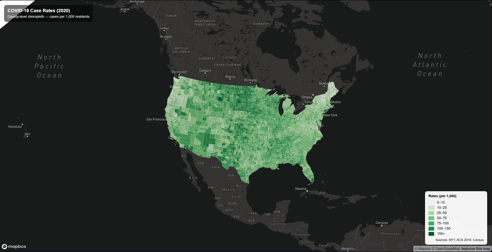
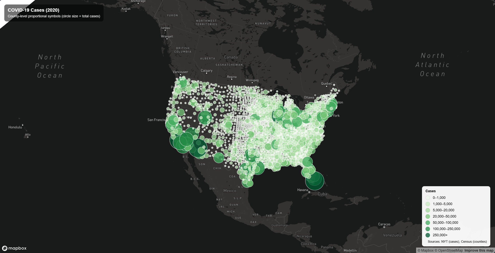

# COVID-19 County Maps (2020)

## Introduction
Two interactive county-level web maps of COVID-19 in the United States (2020): a choropleth of case rates per 1,000 residents and a proportional symbol map of total case counts.

## Maps
- Map 1 (Rates choropleth): https://hieut01.github.io/web_map_lab3/map1.html

- Map 2 (Cases proportional symbols): https://hieut01.github.io/web_map_lab3/map2.html

## Screenshots
- Map 1: 
- Map 2: 

## Primary Functions
Map 1 (Rates)
- Choropleth styling using `rates` (cases per 1,000) with stepped color breaks for quick comparison across counties
- Hover popup showing `county`, `state`, `rates`, `cases`, `deaths`, `pop18` so users can read exact values instead of guessing from color
- Hover outline highlight to clearly show the selected county boundary on a dense national map
- Albers projection to reduce distortion for the U.S. and keep the national view looking balanced

Map 2 (Counts)
- Proportional symbols sized by `cases` so higher-count counties visually stand out while still keeping smaller counties visible
- Circle color also changes by case breaks to reinforce the pattern (size + color together)
- Hover popup showing `county`, `state`, `cases`, `deaths`, `fips` for quick county lookup and verification
- Click-to-zoom interaction to jump into crowded areas and reduce overlap when exploring metro regions
- Albers projection to keep the point distribution visually consistent with the U.S. map layout

## Libraries
- Mapbox GL JS v2.8.1

## Data Sources
- COVID-19 cases/deaths: The New York Times (county totals for 2020)
- Population for rates: 2018 ACS 5-year estimates
- County boundaries: U.S. Census Bureau

## Credits / Acknowledgment
- Lab template and instructions: GEOG 458 (Bo Zhao)
- Data processed for lab use: Steven Bao
